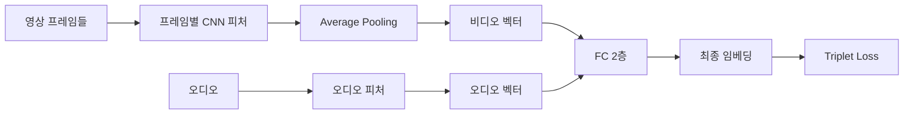
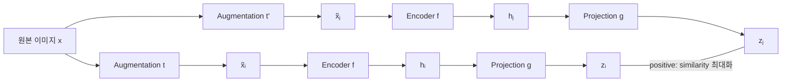

# 컴퓨터비전 16강 — Metric Learning

> **이번 강의 흐름**: 지난 시간 복습(Segmentation) → Metric Learning 개요 → Learning to Rank (NDCG) → Triplet Loss (negative mining, semi-hard) → 응용: FaceNet, 비디오 추천 → Contrastive Learning (DrLIM, negative sampling, SimCLR, NCE)
>
> **다음 강의**: Self-Supervised Learning · **다다음 강의**: Multimodal Learning (오늘 배운 contrastive를 다시 활용)
>
> 📌 공지: 온라인 수업 2–3주 추가 연장 / 기말 발표는 수업 **전** 시간대가 유력 → 수업 전·후 시간 모두 비워두기

---

## 0. 지난 시간 복습 — Segmentation

### Q1. Semantic Segmentation vs Instance Segmentation

| | Semantic Segmentation | Instance Segmentation |
|---|---|---|
| 구분 단위 | **클래스**만 구분 | 같은 클래스여도 **개별 객체**를 구분 |
| 사람 3명이 있으면 | 전부 "사람" | 사람 1, 사람 2, 사람 3 |
| 관점 | 모든 픽셀에 대한 classification | detection + 객체 영역을 픽셀 단위까지 |

### Q2. DeconvNet · U-Net은 왜 feature map을 줄였다가 다시 늘리는가?

1. Segmentation은 **모든 픽셀에 대해 출력**을 내야 하므로 출력 크기 = 입력 크기여야 한다.
2. Classification처럼 줄이고 끝낼 수 없으니 다시 **upsampling**이 필요하다.
3. 처음부터 끝까지 원본 해상도를 유지하는 게 이상적이지만, 출력 하나를 계산하려면 앞단의 넓은 영역을 봐야 해서 **계산량이 폭발**한다.
4. 그래서 가운데에서 줄였다가(계산 가능하게) 다시 늘리는(출력 크기 맞추기) 구조를 택했다.

> 학생 답변 "파라미터 수를 줄이려고" → 핵심은 **dense prediction(출력 크기 제약)** + **계산량** 두 가지.

---

## 1. Metric Learning 개요

### 1.1 절대적 레이블 vs 상대적 레이블

지금까지의 supervised learning(regression, classification)은 **절대적인 정답**이 있었다. ("이건 고양이", "이 영상은 피겨스케이팅")

Metric learning에서는 더 약한 감독 신호, 즉 **상대적 관계**만 주어질 수 있다.

- "앵커 기준으로 A가 B보다 의미적으로 더 가깝다" (이유는 모르지만 아무튼 그렇다)
- 예: 피겨스케이팅 영상과 쇼트트랙 영상은 다른 종목이지만(빙상이라는 공통점), 전혀 다른 슬픈 영상보다는 더 가깝다


### 1.2 정의: 거리 함수를 배운다

**Metric learning = 객체(이미지, 비디오, 텍스트 등) 간의 거리 함수(distance function)를 학습하는 것**

- Distance는 멀수록 큰 값, Similarity는 가까울수록 큰 값 → **방향만 반대, 사실상 같은 일**
- 거리의 의미는 **전적으로 데이터에 의존**
  - 같은 동물이라서 가깝다고 정의할 수도 있고, 사람과 강아지처럼 전혀 다르지만 **시각적으로 비슷**해서 가깝다고 정의할 수도 있음
  - 주관적으로 해석하려 하지 말고, 레이블링한 사람이나 수집 방식이 말하는 similarity를 **그대로 사실로 믿고** 학습
- 여기서도 test set을 따로 빼두고, **안 본 쌍**에 대해 비슷한지/다른지를 맞추는 문제


### 1.3 데이터는 보통 어떤 형태인가

- "이 둘의 유사도는 0.85"처럼 **정확한 수치는 거의 없다** → 사람마다 다르게 답하므로 레이블링 불가 → regression으로 피팅 불가
- 대신 **"이 둘은 비슷하다(positive pair)"** 정도만 주어짐 → 많은 쌍을 보면서 "이 정도면 0.85쯤"을 모델이 스스로 배워야 함
- 레이블의 세분성(granularity)도 다양
  - 완전히 같은 개체의 고양이 > 다른 개체지만 같은 고양이 > 고양이 vs 강아지 > 스파게티
  - **얼마나 다른지**는 알려주지 않고, **어느 쪽이 더 가까운지**만 알려줌
  - 이런 관계가 무수히 많으면 아주 비슷한 것부터 아주 다른 것까지 구분하는 적절한 수치를 배울 수 있으리라 기대
- **순위 리스트** 형태도 가능: 고양이 이미지로 검색했을 때 사람들이 클릭한 순서 = 관련도 순서


### 1.4 왜 이런 데이터를 쓰는가? → 수집이 쉽다

| 출처 | positive로 볼 수 있는 것 |
|---|---|
| 구글 포토 앨범 | 같은 앨범의 사진 (같은 사람 / 같은 장소 / 같은 여행) |
| 유튜브 | 한 로그인 세션 동안 본 영상들 |
| 검색 | 쿼리에 대해 클릭한 결과 (vs 클릭 안 한 결과) |
| 쇼핑 | 함께 많이 구매된 상품 |
| Data augmentation | 같은 이미지를 회전·크기 변환한 것 → positive pair를 **직접 생성** (→ SimCLR) |

→ 레이블러를 고용하지 않고 **사용자 행동(behavior)만으로** 수집 가능 → 저렴하고 대규모

### 1.5 주의할 점

- 그냥 수집한 데이터라 **노이즈가 많다**
- **Transitivity가 성립하지 않을 수 있다**: 쿼리 기준으로 A가 B보다, B가 C보다, C가 D보다 더 비슷해도 A가 D보다 더 비슷하다는 보장이 없음 (클릭 순서처럼 다 비슷비슷한 경우)
- Similarity/distance 자체가 주관적
- 쉽게 모인다고 했지만 **정말 많은 건 아니다**

### 1.6 ⭐ 이건 Supervised일까, Unsupervised일까? (수업 중 질문)

> **교수님 답: 엄밀하게는 Supervised learning**

- 레이블이 **형태만 다르게** 존재할 뿐이다. 값을 직접 맞추는 게 아닐 뿐, "A와 B는 가깝다 / A와 C는 멀다"는 **ground truth**가 주어지고 임베딩이 그에 맞춰 움직인다.
- 진짜 unsupervised는 이미지만 있고 **어노테이션이 전혀 없는** 경우 → clustering, dimensionality reduction 정도만 가능
- **Self-supervised learning**: 사람 레이블러의 직접적인 노력(노동) 없이 수집된 감독 신호를 쓰는 경우를 이렇게 부른다


### 1.7 모달리티가 다른 경우

- 이미지 기준: 텍스트 A가 텍스트 B보다 더 좋은 설명
- 텍스트 기준: 영상 A가 영상 B보다 더 어울림
- → 다다음 시간 **Multimodal Learning**에서 다룸

### 1.8 오늘 다룰 것

| 주제 | 내용 |
|---|---|
| Learning to Rank | 정보 검색(IR) 분야의 랭킹 기본 아이디어, NDCG |
| Triplet Loss | 응용: Face clustering (FaceNet), Video recommendation |
| Contrastive Learning | DrLIM, Negative sampling, SimCLR, NCE |

---

## 2. Learning to Rank

### 2.1 정의

아이템 목록과 그들의 **partial order**가 주어졌을 때, 이를 학습해서 **처음 보는 아이템들**에 대해서도 누가 위/아래에 와야 하는지 순서를 정하는 머신러닝.

- 기준: 선호도 순서, 클릭할 확률 순서 등 정해진 기준에 따른 **permutation**

### 2.2 응용 예시

- **문서 검색**: 검색어(쿼리)와 가장 관련 있는 웹사이트를 순서대로 (구글, 네이버)
- **추천 시스템**: 유저를 쿼리로 보고, 가장 좋아할 영상 10개를 띄우기 (넷플릭스, 유튜브)
- **광고**: 세션 정보 → 컨텍스트 분석 → 광고주들이 "이 정도 맞는 사람에겐 이만큼 내겠다"고 **bidding** → 소팅해서 가장 적절한 광고 노출

### 2.3 세 가지 Formulation

| 방식 | 학습 단위 | 필요한 레이블 | 특징 |
|---|---|---|---|
| **Pointwise** | 아이템 1개 | 절대 점수 (예: 클릭 확률 0–1) | 일반적인 regression/classification. 전부 점수 매긴 뒤 소팅. 가장 단순(무식)한 방법 |
| **Pairwise** ⭐ | 아이템 2개 | 쿼리마다 둘 중 어느 쪽이 더 선호되는지 | **상대적 관계만 보존**하도록 학습. 오늘의 관심사 |
| **Listwise** | 리스트 전체 | 세션에서 보여준 전체 순서/클릭 | 여러 아이템을 한꺼번에 최적화. 순열 수 폭발로 보통 intractable → 근사적으로 **pairwise로 푸는 경우가 많음** |

**Pairwise 보충**

- "이건 0.8점, 저건 0.3점" 같은 ground truth는 없다. 실제로 더 클릭할 것 같은 쪽에 **조금이라도 더 높은 점수**만 주면 된다.
- 학습 목표: 순서가 **역전(inversion)되는 비율을 최소화**
- 100% 보존은 보통 불가능: 데이터가 noisy하고 모델 capacity가 무한하지 않아서 희생할 건 해야 함


### 2.4 모델 구조 관점

Classification/regression과 마찬가지로 모델이 후보마다 **score**를 내고 높은 순으로 정렬한다. 달라지는 건 **loss**뿐이다.

### 2.5 Ranking 모델 = Representation Learning

Classification 모델의 마지막 embedding을 이미지 표현으로 쓰듯, **ranking을 위해 학습한 모델의 embedding도 feature로 쓸 수 있다.** 랭킹을 잘하려면 오브젝트의 본질을 어느 정도 이해했어야 하기 때문.

- **얼굴**: 사람들이 "비슷하다"고 하는 얼굴 관계를 맞히려면 눈·코·입의 배열, 크기, 비율, 피부 상태 등의 피처를 배웠어야 함 → 얼굴 표현 피처로 사용
- **영상**: 사람들이 뭘 좋아하고, 싫어하고, 비슷하다고 느끼는지(general taste)를 배웠어야 함 → 비디오 표현 피처로 사용


### 2.6 ⭐ 평가 지표: NDCG (Normalized Discounted Cumulative Gain)

추천 시스템, 데이터 마이닝, 정보 검색에서 널리 쓰는 랭킹 품질 지표.

**DCG** (상위 $p$개까지):

$$
\mathrm{DCG}_p = \sum_{i=1}^{p} \frac{\mathrm{rel}_i}{\log_2(i+1)}
$$

- $i$는 순위, $\mathrm{rel}_i$는 $i$위에 놓인 아이템의 relevance (별점 1–5점일 수도, 클릭 여부 0/1일 수도)
- **Discounted**: 같은 정답이라도 순위가 낮을수록 적게 쳐준다
  - 1위는 $\log_2 2 = 1$로 나눔 → 100%
  - 2위는 $\log_2 3 \approx 1.585$로 나눔 → 약 63%
  - 순위가 내려갈수록 분모가 커져 가중치 감소
- 이유: **상위권을 맞히는 게 중요**하다. "시체를 숨기기 가장 좋은 곳은 구글 검색 결과 두 번째 페이지" → 아무도 두 번째 페이지는 안 본다

**NDCG**: 쿼리마다 정답 개수가 다르므로(나는 좋아하는 게 5개, 다른 사람은 7개) **가능한 최댓값으로 나눠 정규화**한다.

$$
\mathrm{NDCG}_p = \frac{\mathrm{DCG}_p}{\mathrm{IDCG}_p}
$$

- $\mathrm{IDCG}_p$ (Ideal DCG): 정답들을 최상위에 몰아넣은 이상적인 순서의 DCG, 즉 받을 수 있는 최고 점수
- 범위: 0(다 틀림)부터 1(이상적 순서와 동일)까지


**Discount 가중치 표 (계산용)**

| 순위 $i$ | $\log_2(i+1)$ | $1/\log_2(i+1)$ |
|:-:|:-:|:-:|
| 1 | 1 | 1.000 |
| 2 | 1.585 | 0.631 |
| 3 | 2 | 0.500 |
| 4 | 2.322 | 0.431 |
| 5 | 2.585 | 0.387 |

#### 예제 1

아이템 1–10 중 사용자가 좋아한 것: **{1, 4, 6, 7}** / 모델 추천: **[3, 7, 5]**

| 순위 | 추천 | rel | 기여 |
|:-:|:-:|:-:|:-:|
| 1 | 3 | 0 | 0 |
| 2 | 7 | 1 | 0.631 |
| 3 | 5 | 0 | 0 |

DCG는 다음과 같다.

$$
\mathrm{DCG}_3 = \frac{0}{\log_2 2} + \frac{1}{\log_2 3} + \frac{0}{\log_2 4} = 0.631
$$

3개를 추천할 때 최선은 정답 3개를 1–3위에 놓는 것이다.

$$
\mathrm{IDCG}_3 = 1 + 0.631 + 0.5 = 2.131
$$

$$
\mathrm{NDCG}_3 = \frac{0.631}{2.131} \approx 0.296
$$

> 강의 중 "2.14로 나눠서"라고 말했지만 IDCG는 2.131이 맞고, 결과 0.296은 동일하다.


#### 예제 2

같은 사용자에게 **[3, 7, 5, 4, 2]** 추천 (4위·5위 추가)

| 순위 | 추천 | rel | 기여 |
|:-:|:-:|:-:|:-:|
| 1 | 3 | 0 | 0 |
| 2 | 7 | 1 | 0.631 |
| 3 | 5 | 0 | 0 |
| 4 | 4 | 1 | 0.431 |
| 5 | 2 | 0 | 0 |

DCG는 다음과 같다.

$$
\mathrm{DCG}_5 = 0.631 + 0.431 = 1.062
$$

정답은 4개뿐이므로 최선은 1–4위에 정답, 5위는 오답이다.

$$
\mathrm{IDCG}_5 = 1 + 0.631 + 0.5 + 0.431 + 0 = 2.562
$$

$$
\mathrm{NDCG}_5 = \frac{1.062}{2.562} \approx 0.414
$$

→ 하나를 더 맞히니 0.296에서 0.414로 상승

> (보충) 실무에서는 분자를 $2^{\mathrm{rel}_i} - 1$로 쓰는 변형도 흔하다. 수업에서는 $\mathrm{rel}_i$ 그대로 사용.


---

## 3. Triplet Loss

> 역사: Triplet loss가 먼저 유행(2015–2020년 주류) → 이후 contrastive learning이 등장하면서 "triplet loss는 그 special case"로 정리됨

### 3.1 Triplet의 구성

학습 예제 하나 = 오브젝트 **3개**: **Anchor** $a$, **Positive** $p$, **Negative** $n$

- 의미: **"앵커는 네거티브보다 포지티브에 더 가깝다"**
- 목표: 임베딩 공간에서 $a$와 $p$는 가깝게, $n$은 $p$보다 멀리
- 네거티브가 포지티브보다 앵커에 더 가까운(역전된) triplet이 있을 때마다 임베딩을 업데이트해서 $n$은 밀어내고 $p$는 당겨온다

### 3.2 수식

임베딩 함수 $f$에 대해 거리를 다음과 같이 두면

$$
d(a, p) = \Vert f(a) - f(p) \Vert_2^2, \qquad d(a, n) = \Vert f(a) - f(n) \Vert_2^2
$$

Triplet loss는 다음과 같다.

$$
L(a, p, n) = \max\left(0, d(a, p) - d(a, n) + \alpha\right)
$$

- 잘 맞는 관계라면 $d(a,p) - d(a,n)$은 음수
- 양수라면 positive가 더 멀다는 뜻 → 틀린 관계 → **loss 발생**
- **Margin $\alpha$** (하이퍼파라미터)
  - 아주 살짝만 멀어져도 되게 두면 거의 같은 값에 수렴해버릴 수 있어 noisy
  - → 두 거리의 차이가 **적어도 $\alpha$만큼은 나도록** 강제

> (보충) FaceNet 원 논문은 임베딩을 $\Vert f(x) \Vert_2 = 1$로 정규화(단위 초구면 위)하고, 배치의 triplet들에 대해 위 loss를 합산한다.


### 3.3 데이터 수집: Random Negative의 문제

- **Positive는 수집하기 쉽다**: 같은 앨범의 사진, 같은 사람이 클릭한 이미지 등
- **Negative는 훨씬 많다**: 클릭하지 않은 세상의 나머지 모든 이미지, 시청하지 않은 모든 비디오 → 따로 수집하지 않음
- 그래서 보통 positive만 수집하고 negative는 **무작위로 할당(random assignment)**

**문제: random negative는 너무 쉽다**

- "앵커가 이것보다 포지티브에 더 가깝다"에 대해 "당연하지" 수준의 negative가 들어옴
- 학습 극초반에나 배울 게 있고, 조금만 학습되면 **loss가 거의 0** → 더 배울 게 없음
- 예: 전혀 다른 카테고리의 negative는 **easy triplet**이라 금방 배우지만, 같은 차종의 구형과 신형을 구분하는 **hard triplet**은 더 많은 학습이 필요
- → 단순한 지식만 배우고 원하는 수준에 도달하기 전에 수렴해버림 → **Negative Mining** 기법 등장


### 3.4 Online Negative Mining

핵심 아이디어: **원래 들어있던 negative는 어차피 무작위로 넣은 것 → 꼭 그걸 쓸 필요가 없다.**

1. 현재 배치에는 (배치 크기 × 3)개의 이미지/비디오가 올라와 있다
2. 자기 자신의 앵커·포지티브를 제외한 나머지는 (positive는 몇 개 없을 테니) 확률상 대부분 **negative 후보**
3. 그중 **현재 임베딩상 앵커에 가장 가까운 것**, 즉 모델이 positive라고 **가장 헷갈리고 있는 것**을 찾는다
4. 그걸 이 앵커의 negative로 **교체**한다

→ 이 기법을 쓴 것과 안 쓴 것의 성능 차이가 **엄청나다**


**배치 크기가 중요하다**

- 모델이 헷갈리는 negative가 후보 안에 있어야 의미가 있음 → 후보 셋이 커야 함 → **배치가 커야 함**
- 교수님 실험: 배치 크기를 **7,200까지** 키우는 동안 성능이 계속 올라감

배치 크기를 무한히 키울 수 없는 이유:

| 한계 | 설명 |
|---|---|
| 계산량 | 가장 가까운 것을 찾는 k-NN이 배치 크기의 **제곱**에 비례 |
| 메모리 | 7,200 × 3 = **21,600개** 오브젝트를 GPU에 올릴 수 없음 |


### 3.5 ⭐⭐ Semi-hard Negative Mining (오늘 가장 중요한 부분 중 하나)

앞에서 "앵커에 가장 가까운 negative를 고른다"고 했지만, **실제로 그렇게 하면 잘 안 된다.**

앵커 $a$, positive $p$, 그리고 negative 후보들을 앵커로부터의 거리 순으로 놓아보자.

```
distance from anchor a  --->

a ------ n1 ------ p ------ n2 ------|------ n3
                   ^                 ^
                d(a,p)          d(a,p) + alpha

         [hard]        [semi-hard]        [easy]
```

우리가 원하는 최종 상태는 **모든 negative가 $n_3$처럼 margin 밖에 있는 것**이다. 하지만 한 번에 다 밀어낼 수 없으니 하나를 골라야 한다.

| 후보 | 위치 | 이 triplet의 loss | 고를까? |
|---|---|---|---|
| $n_3$ (easy) | margin 밖 | 0 | ✗ 이미 충분히 멀어서 배울 게 없음 |
| $n_1$ (hardest) | positive보다 가까움 | $\alpha$보다 **큼** | ✗ **collapse 위험** |
| $n_2$ (semi-hard) | positive보다 멀지만 margin 안 | 0과 $\alpha$ 사이 | ✓ |

**왜 $n_1$(가장 가까운 것)을 고르면 안 되나?**

- $n_1$은 너무 가까워서 $d(a,p) - d(a,n_1)$이 크게 양수 → loss가 $\alpha$보다 큼
- 모델 입장에서 이 loss를 줄이는 **가장 싼 방법**은 멀리 밀어내는 게 아니라, 그냥 **모든 임베딩을 한 점으로 뭉개는 것** (예: $f(x) = 0$)
- 그러면 모든 거리가 0 → loss가 정확히 $\alpha$ → "$\alpha$만큼은 그냥 포기"하는 게 이득인 **꼼수**
- 결과: 모델이 **아무것도 안 배움** (collapse)

**왜 $n_2$(semi-hard)는 되나?**

- loss가 이미 $\alpha$보다 작다 → collapse하면 loss가 오히려 $\alpha$로 **커짐** → 손해
- 조금만 밀어내면 loss를 줄일 수 있으니 **원하는 방향으로 안정적으로 학습**

**Semi-hard 조건**: positive보다는 멀지만, 아직 $\alpha$만큼은 멀지 않은 것

$$
d(a, p) < d(a, n) < d(a, p) + \alpha
$$

**그럼 $n_1$은 영영 학습 안 되나?** → 아니다. 다른 앵커와 짝지어질 때 negative가 계속 바뀌며 들어오므로, 언젠가 선택되어 조금씩 멀어지고 결국 margin 밖으로 나간다.

> 2015–2020년 당시엔 이런 튜닝을 알아야 해서 굉장히 중요한 스킬이었다. 요즘은 대부분 contrastive learning으로 넘어감.


---

## 4. 응용 ① Face Clustering — FaceNet

- Google, 2015 (Schroff et al., *FaceNet*)
- "어떤 사진이 어떤 사진과 가깝다/멀다"는 정보만으로 triplet loss를 최적화 → 임베딩 → 거리(유사도) 계산 가능
- **거리가 작을수록 같은 사람** → 가까운 얼굴끼리 뭉쳐 클러스터 생성
- 구조: 특별한 것 없음. 예전에 배운 **ZFNet**(AlexNet과 거의 비슷한 구조) 계열과 **Inception** 모델에, 배치에서 3개씩 묶어 triplet loss로 학습
- 성능 지표(수업 설명): 실제로 같은 사람인 쌍 중 모델이 같은 사람이라고 맞힌 비율 → **recall과 비슷한 개념**, 약 **90%** (같은 사람 사진 10장이면 9장 정도를 찾음)
- 활용: **구글 포토**의 같은 인물 자동 앨범
- 한계: 꽤 틀림. 닮은 다른 사람을 묶기도 함


---

## 5. 응용 ② Video Recommendation (교수님 YouTube 연구)

### 5.1 문제 설정

- **Video-to-video 추천**: 지금 보고 있는 영상 옆에 뜨는 "다음에 볼 영상" 찾기
- 유저와는 크게 상관없음: 이걸 보고 있는 사람에게 다음으로 이걸 보여준다
- 학습 데이터: **이 영상 다음에 사람들이 많이 본 영상 = positive pair**


### 5.2 Co-watch Graph와 Triplet 샘플링

- **노드** = 비디오, **엣지** = 이 영상을 본 다음 사람들이 많이 본 영상
- 유튜브 모든 비디오의 클릭/시청을 카운트 → 영상마다 가장 많이 이어서 본 **최대 50개**에 엣지 연결

| 역할 | 샘플링 방법 |
|---|---|
| Anchor | 무작위로 하나 |
| Positive | 앵커와 **연결된** 노드 중 하나 |
| Negative | 연결되지 않은 것 중 **무작위** (그래프가 워낙 커서 랜덤이면 거의 negative) |

→ Triplet loss로 학습하면 **같이 많이 시청된 영상끼리 뭉치는** 임베딩이 만들어짐


### 5.3 모델 (진짜 간단)



- 프레임 단위로 CNN 피처 추출 → average pooling → 영상 전체를 표현하는 비디오 벡터
- 오디오도 마찬가지로 전체 영상을 표현하는 벡터 하나
- Fully connected 2층 정도 → 비디오와 오디오 정보를 함께 담은 최종 임베딩
- 이 뒷부분만 triplet loss로 학습


### 5.4 임베딩 활용

- **Nearest neighbor search** → 관련 비디오 추천
- 유저 모델링 추가 → **개인화 추천**
- 레이블 데이터로 **비디오 분류** → 자동 태깅 ("이건 무엇에 대한 영상")

### 5.5 결과 예시

- **K-pop 영상** → 추천 3개 모두 K-pop. 학습에 **제목은 전혀 안 쓰고 영상만** 썼는데도
- **머리 땋기(braids) 영상** → 추천된 영상이 **러시아어, 스페인어, 한국어**로 모두 언어가 다름
  - 세 언어를 다 하는 사람이 다 봤을 리 없음 → co-watch만으로는 설명 안 됨
  - 시각 정보로 **주제(topic)적 유사성**을 임베딩이 잡아냈다는 증거
- **종합**: 사람들이 함께 본 **그래프 정보**와 **콘텐츠 자체 정보**를 모두 담은 임베딩

### 5.6 한계

- 배치 크기가 약 7,200은 돼야 잘 돌아감 → 21,000개 이상의 비디오를 당시 GPU 메모리에 못 올림
- Online negative mining을 **CPU**에서 돌릴 수밖에 없음 → 학습에 **2–4주**
- 랜덤 negative와 대규모 online mining을 걷어내고 싶었지만 불가능


### 5.7 후속 연구: 계층적 클러스터링으로 Hard Negative 만들기 (교수님의 첫 CVPR 논문)

아이디어: negative를 멀리 있는 아무거나가 아니라 **그럴듯하게 가까운 것**으로 넣자.

1. 그래프 노드를 **hierarchical clustering** (threshold를 점점 완화하며 반복 병합 → 트리 구조)
2. **Positive**: 앵커와 같은 클러스터
3. **Negative**: **조부모를 공유하는 형제 클러스터**에서 선택 → 완전 랜덤보다 hard

```
               [grandparent]
              /             \
      [cluster A]        [cluster B]
       a, p, ...          n, ...
```

**검증: 미리 넣어둔 negative가 online mining 후에도 실제로 선택되는 비율**

| Negative 방식 | 실제로 선택되는 비율 |
|---|---|
| 완전 랜덤 | 약 1/(배치 크기), 즉 우연 수준 |
| 계층적 클러스터링 | 약 **12%** (대략 1/8) → 진짜 hard negative가 맞음 |

- 한계: 결국 large batch + online mining을 **걷어내진 못함**. 여전히 그걸 해야 잘 됨 → **완화**하는 수준까지만 성공

> 참고 논문 (보충): Lee et al., *Collaborative Deep Metric Learning for Video Understanding* (KDD 2018) / Lee et al., *Large Scale Video Representation Learning via Relational Graph Clustering* (CVPR 2020)


---

## 6. Contrastive Learning

### 6.1 개념

- **Contrast** = 대조. "이건 더 가깝게, 저건 더 멀게"라는 목표는 triplet과 같다
- 차이: 데이터로는 **positive 관계만** 정의하고, negative를 따로 수집하지 않는다 → 배치의 나머지나 랜덤 노이즈를 negative로 활용

### 6.2 시초: Pairwise Loss — DrLIM (Hadsell, Chopra, LeCun, 2006)

두 이미지가 비슷한지($Y=0$) 아닌지($Y=1$)를 레이블로 주고, **similar용 loss와 dissimilar용 loss를 따로** 만든 뒤 레이블을 곱해서 조건부로 쓰는 구조다.

$$
L(W, Y, x_1, x_2) = (1 - Y) \cdot \frac{1}{2} D_W^2 + Y \cdot \frac{1}{2} \left(\max(0, m - D_W)\right)^2
$$

여기서 $D_W = \Vert G_W(x_1) - G_W(x_2) \Vert_2$는 모델 $G_W$가 만든 두 임베딩 사이의 거리, $m$은 margin이다.

| 경우 | 살아남는 항 | 모양 | 의미 |
|---|---|---|---|
| $Y = 0$ (similar) | $\frac{1}{2} D_W^2$ | 거리가 멀수록 loss 증가 | 당긴다 |
| $Y = 1$ (dissimilar) | $\frac{1}{2}\left(\max(0, m - D_W)\right)^2$ | 거리가 작을수록 loss 증가, $m$을 넘으면 0 | 밀어낸다 |

- 왜 하필 이 함수인지는 논문 참고 (이렇게 설계했을 때 가장 잘 됐다고 함)
- **MNIST 결과**: 같은 숫자끼리 뭉침. 4와 9가 섞인 영역에는 실제로 **4인지 9인지 애매한 글씨**가 모여 있음 → 하드 레이블로 classification한 것과는 다른 성질
- 정확한 레이블 없이 **상대적 관계만으로 contrast**를 처음 적용한 논문으로 소개됨

### 6.3 동기: Softmax의 계산 문제 → Negative Sampling

초반에 배운 softmax는 다음과 같다.

$$
p(y = k \mid x) = \frac{\exp(s_k)}{\sum_{j=1}^{K} \exp(s_j)}
$$

Cross-entropy loss로 쓰면

$$
L = -\log p(y \mid x) = -s_y + \log \sum_{j=1}^{K} \exp(s_j)
$$

**문제: 클래스 수 $K$가 너무 크다**

- 유튜브 비디오 분류 vocabulary는 5년 전에 이미 10만 개 이상 (약 13만)
- 정답 1개, 그럴듯한 오답 몇 개, 그리고 **명백히 아닌 것 10만 개**
- 분모 때문에 **거의 0이 확실한 클래스까지 전부** exp를 계산해야 함
- Backprop에서도 정답 클래스 score는 올리고 **나머지 모든 클래스 score를 조금씩 내림** → 모든 training example마다 모든 클래스를 업데이트
- 이미 거의 0인 값을 계속 더 줄이느라 학습이 매우 오래 걸림

> (보충) 수식으로 보면 $\partial L / \partial s_j = p(j \mid x) - \mathbf{1}(j = y)$ 이므로, 정답이 아닌 **모든** $j$에 대해 gradient가 0이 아니다.

Word2vec 예시(수업 슬라이드): 문장 하나로 학습할 때마다 "zebra"라는 단어의 파라미터를 매번 업데이트해야 하나? 이미 확률이 0.001인데 그걸 계속 조금씩 더 줄이는 게 의미가 있나?

**해결: Negative Sampling**

- 어차피 거의 다 0 → **오답이 될 만한 hard negative만 샘플링**해서 그것들만 찍어 누르자
- ⭐ **Triplet loss에서 negative mining을 한 이유와 본질적으로 같은 욕구**

### 6.4 SimCLR (Chen, Kornblith, Norouzi, Hinton, 2020)

- 딥러닝의 아버지 **Hinton** 교수 논문. "심클리어"라고 읽음 (학회 ICLR을 "아이클리어"라고 발음하듯)
- **Positive를 augmentation으로 직접 만들어 쓰는** 모델 → 레이블 불필요 → **self-supervised**
- 2020년 굉장히 센세이셔널했던 이미지 self-supervised 방법

**절차**

1. 배치 크기 $N$ → 이미지마다 **서로 독립적인 두 가지 augmentation** (다른 부분 crop, 확대·축소, 흑백, 회전 등) → 총 $2N$장 ($\tilde{x}_i$, $\tilde{x}_j$)
2. 인코더로 피처 벡터 $h_i$, $h_j$ 추출
3. **같은 이미지에서 나온 쌍은 similarity를 높이고**, 미니배치 안의 나머지 **$2N - 2$개는 전부 negative로 similarity를 낮춘다**



**Loss (NT-Xent)**

$$
\ell_{i,j} = -\log \frac{\exp\left(\mathrm{sim}(z_i, z_j) / \tau\right)}{\sum_{k=1}^{2N} \mathbf{1}(k \neq i) \exp\left(\mathrm{sim}(z_i, z_k) / \tau\right)}
$$

- **분자**: positive 쌍 ($i$, $j$)의 score → 올린다
- **분모**: 나 자신을 제외한 배치 내 모든 이미지와의 similarity → 낮춘다
- 앞의 softmax 식과 같은 형태지만, 분모의 합이 **전체 데이터셋(모든 클래스)이 아니라 현재 미니배치 안**에서만 → 일종의 **샘플링**
- 하지만 미니배치 안의 것은 **하나도 빼지 않고 전부** 사용

> (보충) $\mathrm{sim}$은 cosine similarity, $\tau$는 temperature 하이퍼파라미터. 원 논문은 인코더 출력 $h$ 뒤에 작은 MLP(projection head) $g$를 달아 $z = g(h)$에서 loss를 계산한다. 수업에서는 $h$ 수준까지만 설명했다.

**⭐ Triplet Loss는 Contrastive Loss의 Special Case**

| | Triplet (+ online mining) | SimCLR (Contrastive) |
|---|---|---|
| Positive | 데이터에서 수집 (co-watch, 같은 앨범 등) | **Augmentation으로 생성** |
| Negative | 배치에서 **1개만** 골라 사용 | 배치의 나머지 **$2N-2$개 전부** 사용 |
| 레이블 | 상대적 관계 필요 | 불필요 |

→ Contrastive는 미니배치 전체를 negative로 쓰고, triplet은 그중 하나만 고른 것 → triplet이 special case

### 6.5 NCE — Noise Contrastive Estimation (Gutmann & Hyvärinen, 2010)

> 오늘의 마지막 난관. 원래 **word embedding**에서 쓰인 방법

같은 문제(모든 클래스의 확률을 다 업데이트해야 하나?)를 **다른 방식**으로 해결한다. 다음 단어가 무엇인지 맞히는 대신, **"이게 진짜 그럴듯한 쌍이냐 아니냐"만 맞히는 이진 분류기**를 학습한다.

| | 워드 임베딩에서 | 우리 문제에서 (예) |
|---|---|---|
| True pair | 중심 단어 + 주변에 함께 등장한 단어 | 같은 사람의 얼굴끼리 (원하는 대로 정의) |
| Fake pair | 무작위로 묶은 쌍 | 무작위로 묶은 쌍 |

**설정**

- 진짜 분포 $p_m$ (positive pair들)에서 $M$개 샘플: $x_1, \dots, x_M$
- 가짜(노이즈) 분포 $p_n$ (무작위 쌍)에서 $N$개 샘플: $y_1, \dots, y_N$
- 이 $M+N$개가 섞인 미니배치에서 각 샘플이 **진짜 분포에서 왔는지 가짜 분포에서 왔는지** 맞히기 → 클래스는 딱 2개 → **logistic regression**
- 원래 클래스 수가 아무리 많아도 상관없음

**수식**

로그 오즈(진짜 확률 대 가짜 확률의 비에 로그를 씌운 것):

$$
G(u; \theta) = \ln p_m(u; \theta) - \ln p_n(u)
$$

Logistic regression:

$$
h(u; \theta) = \frac{1}{1 + \exp\left(-G(u; \theta)\right)}
$$

목적함수 (최대화):

$$
J(\theta) = \frac{1}{M} \left[ \sum_{t=1}^{M} \ln h(x_t; \theta) + \sum_{t=1}^{N} \ln\left(1 - h(y_t; \theta)\right) \right]
$$

**해석 (체인으로 따라가기)**

- **진짜 샘플 $x$** → $h(x)$를 키워야 함
  - $h$가 커지려면 분모 $1 + \exp(-G)$가 작아져야 하고, 그러려면 $G$가 커져야 함
  - $G$가 커지려면 $p_m(x; \theta)$가 커져야 함 → 모델이 진짜 샘플에 높은 확률을 주도록 학습
- **가짜 샘플 $y$** → $1 - h(y)$를 키워야 함 → $h(y)$ 감소 → $G$ 감소 → $p_m(y; \theta)$ 감소 → 가짜는 진짜 분포에서 나왔을 확률을 낮게 예측
- **$p_n$ 쪽은 학습할 게 없다**: 우리가 아무렇게나 만든 고정된 랜덤 분포라 파라미터 $\theta$가 없음

**결론**: 모든 클래스의 score를 다 계산할 필요 없이, 샘플된 진짜 예제에 가짜 예제를 추가로 뽑아 섞고 **진짜면 올리고, 가짜면 내리면** contrast가 된다.

> (보충) 원 논문의 일반형은 노이즈 비율 $\nu = N/M$을 넣어 $h = 1 / (1 + \nu \exp(-G))$로 쓴다. 위 식은 이를 단순화한 형태.

> 교수님: 이 부분은 금방 듣고 이해할 수 있는 내용이 아니니 **논문을 꼭 읽어보라**. 뒤의 Multimodal Learning에서 이 개념을 활용한다.

### 6.6 Negative를 다루는 방식 비교

| 방법 | Negative 출처 | 사용 방식 |
|---|---|---|
| Softmax + Cross-entropy | 전체 $K$개 클래스 | 전부 계산·업데이트 (비쌈) |
| Triplet + online mining | 현재 배치 | semi-hard **1개** 선택 |
| SimCLR | 현재 배치 | 나머지 **$2N-2$개 전부** |
| NCE | 노이즈 분포 $p_n$ | 진짜/가짜 **이진 분류** |

### 6.7 앞으로의 연결

- **다음 시간: Self-Supervised Learning** (이번 학기 새로 만든 강의)
- **다다음: Multimodal Learning**: 이미지–텍스트 쌍에 contrastive를 적용 (보충: CLIP의 이미지–텍스트 contrastive loss가 대표적. SimCLR/NCE 식을 이해해두면 바로 연결됨)

---

## 7. 한눈에 정리

1. **Metric learning** = 거리(유사도) 함수 학습. 상대적 레이블만으로 가능하고, 사용자 행동에서 싸게 대량 수집 가능. 엄밀히는 supervised(레이블 형태만 다름)이고, 사람 노동 없이 수집되면 self-supervised.
2. **Learning to Rank**: pointwise / **pairwise** / listwise. 평가는 **NDCG** = DCG / IDCG, 상위 순위일수록 큰 가중치 $1/\log_2(i+1)$.
3. **Triplet loss**: $\max(0, d(a,p) - d(a,n) + \alpha)$. Random negative는 너무 쉬움 → **online negative mining** (큰 배치 필요) → 가장 가까운 걸 고르면 collapse → **semi-hard** negative 선택.
4. **응용**: FaceNet(얼굴 클러스터링, 구글 포토), 유튜브 비디오 추천(co-watch graph, 계층적 클러스터링 hard negative).
5. **Contrastive**: DrLIM(similar/dissimilar 분리 loss) → softmax 분모 문제 → **negative sampling** → **SimCLR**(augmentation positive, 배치 전체 negative, triplet은 special case) → **NCE**(진짜 vs 노이즈 이진 분류).

---

## 8. 복습 질문 (수업 시작 구두 질문 대비)

<details>
<summary><b>Q1. Metric learning이 학습하는 것은? 거리와 유사도의 관계는?</b></summary>

객체 간의 거리 함수(distance function). Distance는 멀수록 큰 값, similarity는 가까울수록 큰 값을 주므로 방향만 반대이고 사실상 같은 일을 한다.

</details>

<details>
<summary><b>Q2. 정확한 유사도 수치 대신 상대적 관계 데이터를 쓰는 이유는?</b></summary>

유사도는 주관적이라 수치로 레이블링하기 어렵고, 상대적 관계는 앨범·시청 세션·검색 클릭·함께 구매 같은 사용자 행동에서 레이블러 없이 저렴하고 대규모로 수집할 수 있기 때문. Augmentation으로 positive pair를 직접 만들 수도 있다.

</details>

<details>
<summary><b>Q3. 상대적 관계만으로 학습하는 metric learning은 supervised인가 unsupervised인가?</b></summary>

엄밀하게는 supervised. 레이블이 형태만 다를 뿐 "무엇이 무엇에 더 가깝다"는 ground truth가 주어진다. 진짜 unsupervised는 어노테이션이 전혀 없어 clustering이나 차원 축소 정도만 가능하다. 사람의 노동 없이 수집된 감독 신호를 쓰면 self-supervised라고 부른다.

</details>

<details>
<summary><b>Q4. Pointwise, pairwise, listwise의 차이는?</b></summary>

Pointwise는 아이템마다 절대 점수를 예측해 정렬(일반 regression/classification). Pairwise는 두 아이템 중 어느 쪽이 더 선호되는지 상대 관계만 보존하도록 학습. Listwise는 리스트 전체 순서를 한꺼번에 최적화하지만 intractable해서 보통 pairwise로 근사한다.

</details>

<details>
<summary><b>Q5. (연습 문제) 좋아한 아이템 {2, 5}, 추천 [5, 1, 2]일 때 NDCG@3은?</b></summary>

DCG@3 = 1/1 + 0 + 1/2 = 1.5. 정답이 2개뿐이므로 IDCG@3 = 1 + 0.631 = 1.631. NDCG@3 = 1.5 / 1.631 ≈ 0.920.

</details>

<details>
<summary><b>Q6. Triplet loss에서 margin α의 역할은?</b></summary>

앵커–포지티브 거리와 앵커–네거티브 거리의 차이가 적어도 α만큼은 나도록 강제한다. Margin이 없으면 아주 살짝만 멀어져도 loss가 0이 되어 거의 같은 값으로 수렴하는 noisy한 임베딩이 될 수 있다.

</details>

<details>
<summary><b>Q7. Random negative의 문제점은?</b></summary>

대부분 너무 쉬운(easy) negative라서 학습 초반 이후 loss가 거의 0이 되어 더 배울 것이 없고, 단순한 지식만 배운 채 수렴해버린다.

</details>

<details>
<summary><b>Q8. Online negative mining이란? 배치 크기가 왜 중요한가?</b></summary>

어차피 무작위로 넣은 negative를, 현재 배치에 있는 다른 샘플들 중 현재 임베딩상 앵커에 가까운(모델이 헷갈리는) 것으로 교체하는 방법. 헷갈리는 negative가 후보 안에 있어야 하므로 후보 셋, 즉 배치가 클수록 좋다(교수님 실험에서 7,200까지 계속 향상). 단, k-NN 계산량이 배치 크기의 제곱에 비례하고 GPU 메모리 한계가 있다.

</details>

<details>
<summary><b>Q9. 앵커에 가장 가까운 negative를 고르면 왜 안 되는가?</b></summary>

그런 negative는 loss가 α보다 크게 나온다. 모델 입장에서는 그것을 밀어내는 것보다 모든 임베딩을 한 점(예: f(x) = 0)으로 뭉개서 loss를 α로 만드는 쪽이 더 싸기 때문에, 아무것도 배우지 않는 collapse가 일어난다.

</details>

<details>
<summary><b>Q10. Semi-hard negative의 조건은?</b></summary>

$d(a,p) < d(a,n) < d(a,p) + \alpha$. 즉 포지티브보다는 멀지만 아직 margin만큼은 멀지 않은 negative. 이때 loss가 α보다 작으므로 collapse가 오히려 손해라서 원하는 방향으로 안정적으로 학습된다.

</details>

<details>
<summary><b>Q11. 비디오 추천 연구에서 머리 땋기 영상 결과가 보여주는 것은?</b></summary>

추천된 영상들의 언어(러시아어·스페인어·한국어)가 모두 달라 co-watch 정보만으로는 설명하기 어렵다. 임베딩이 시각적 콘텐츠로부터 주제적 유사성을 잡아냈다는 것, 즉 그래프 정보와 콘텐츠 정보를 함께 담고 있다는 것을 보여준다.

</details>

<details>
<summary><b>Q12. Softmax cross-entropy에서 negative sampling이 필요한 이유는?</b></summary>

분모에 모든 클래스의 합이 있어서, 클래스가 10만 개 이상이면 거의 0이 확실한 클래스까지 매번 계산하고 업데이트해야 한다. 어차피 거의 0이므로 hard negative만 샘플링해서 누르면 충분하다. Triplet loss에서 negative mining을 한 이유와 같은 동기다.

</details>

<details>
<summary><b>Q13. SimCLR에서 positive와 negative는? Triplet loss와의 관계는?</b></summary>

같은 이미지에 서로 다른 augmentation을 두 번 적용해 만든 두 뷰가 positive, 미니배치 안의 나머지 2N−2개가 모두 negative. Triplet loss는 그중 negative를 하나만 고른 것이므로 contrastive loss의 special case다.

</details>

<details>
<summary><b>Q14. NCE에서 노이즈 분포 p_n 쪽은 왜 학습할 것이 없는가?</b></summary>

p_n은 우리가 무작위로 만든 고정된 분포라서 파라미터 θ가 없다. 학습은 모델 p_m(u; θ)에 대해서만 일어나며, 진짜 샘플이면 확률을 올리고 가짜 샘플이면 확률을 내린다.

</details>

<details>
<summary><b>Q15. (복습) Segmentation 네트워크가 feature map을 줄였다가 다시 늘리는 이유는?</b></summary>

모든 픽셀에 대해 출력해야 하므로 출력 크기가 입력과 같아야 하고, 그렇다고 원본 해상도를 끝까지 유지하면 계산량이 폭발하기 때문에 가운데서 줄였다가 다시 upsampling한다.

</details>
