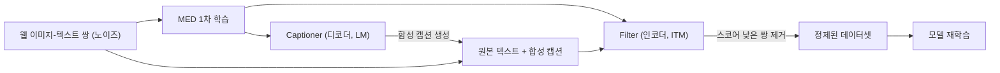

# 멀티모달 러닝 (Multimodal Learning)

> **이번 강의 범위**: 멀티모달리티 개념 → 데이터 수집 → Image–Text (VL-BERT, ViLBERT) → Video–Text (VideoBERT, CBT, MERLOT) → Audio (Spectrogram, AST) → VATT → CLIP → MuLan → BLIP
>
> **선수 강의**: 지난 온라인 강의 2개 (Metric Learning, Self-supervised Learning). CBT · VATT · CLIP · BLIP의 contrastive loss는 Metric Learning 강의 내용을 전제로 함.
>
> **표기**: 📎 = 강의 외 원 논문 기준 보충 · ⚠️ = 강의 설명과 논문이 다르거나 녹취가 불분명한 부분

---

## 0. 한눈에 보기

### 0.1 강의 전체를 관통하는 세 가지 질문

1. 이미지 · 비디오 · 오디오를 **어떻게 토큰 시퀀스로 만들어** 트랜스포머에 넣을 것인가?
2. 가려진(masked) 시각 토큰의 **정답(target)을 무엇으로** 줄 것인가?
3. 두 모달리티가 **짝이 맞는지(alignment)** 를 어떻게 학습시킬 것인가?

### 0.2 모델 요약표

| 모델 | 연도 | 모달리티 | 시각/청각 입력 | 사전학습 과제 | 핵심 아이디어 |
|---|---|---|---|---|---|
| VL-BERT | 2019 | 이미지–텍스트 | Faster R-CNN RoI | MLM + Masked RoI Classification | 단일 스트림 BERT에 visual feature embedding 추가 |
| ViLBERT | 2019 | 이미지–텍스트 | Faster R-CNN RoI | Masked Multimodal Modeling + Alignment Prediction | 두 스트림 + Co-attention |
| VideoBERT | 2019 | 비디오–텍스트(ASR) | 1.5초 클립의 S3D 특징 | Alignment + MLM + Masked Frame Modeling | 가려진 프레임 → k-means 클러스터 ID 예측 |
| CBT | 2019 | 비디오–텍스트(ASR) | S3D 특징 | 텍스트 MLM + 시각 NCE + 크로스모달 NCE | 클러스터링 제거 → end-to-end 학습 |
| MERLOT | 2021 | 비디오–텍스트(ASR) | ViT 계열 프레임 인코더 | 프레임–자막 매칭 + MLM + Temporal Reordering | 섞인 프레임 순서 맞추기 |
| AST | 2021 | 오디오 | 스펙트로그램 패치 | 오디오 분류 (지도학습) | 스펙트로그램 = 이미지, ImageNet ViT로 초기화 |
| VATT | 2021 | 비디오–오디오–텍스트 | 비디오 · 오디오 · 텍스트 토큰 | V–A NCE + V–T MIL-NCE | 모달리티 쌍마다 contrastive |
| CLIP | 2021 | 이미지–텍스트 | ViT / ResNet | N×N 이미지–텍스트 대조 학습 | 초대규모 웹 데이터 + 단순한 매칭 목표 |
| MuLan | 2022 | 음악–텍스트 | 스펙트로그램 | CLIP과 동일 | CLIP 아이디어를 음악에 적용 |
| BLIP | 2022 | 이미지–텍스트 | ViT | ITC + ITM + LM | MED(이해 + 생성) + CapFilt(데이터 정제) |

---

## 1. 복습: SSL의 두 가지 의미

"SSL"이라는 약어는 두 가지를 모두 가리킬 수 있으므로 문맥으로 구분해야 한다.

| 구분 | Self-supervised Learning | Semi-supervised Learning |
|---|---|---|
| 사용 데이터 | 레이블 **없는** 데이터만 | 소량의 레이블 데이터 + 대량의 비레이블 데이터 |
| 감독 신호 | 데이터 자체의 구조 · 관계로 만든 과제(pretext task)를 레이블처럼 사용 | 실제 레이블 + 비레이블 데이터를 함께 활용 |
| 예시 | BERT의 MLM, contrastive learning | pseudo-labeling 등 |

**이번 강의와의 연결**: 사람이 레이블링하지 않아도 모달리티 사이의 관계(이미지 ↔ 캡션, 영상 ↔ 나레이션)가 그 자체로 supervision signal이 된다. 그래서 멀티모달 데이터는 self-supervised learning의 대표적인 재료다.

---

## 2. 멀티모달리티란

### 2.1 동기

- LLM이 텍스트만 주고받던 단계에서 한 단계 나아가, **이미지 · 오디오 파일을 함께 넣고 질문하면 그것까지 참고해서 답하는** 모델(요즘 말하는 omni model 등)이 널리 쓰이고 있음
- 이런 기능의 기본 토대가 멀티모달 모델

### 2.2 "Modality"의 어원: 통계학의 mode

- **mode(최빈값)**: 분포에서 확률(밀도)이 가장 높은 봉우리 지점
- **unimodal distribution**: 봉우리가 1개 (예: 정규분포)
- **multimodal distribution**: 봉우리가 여러 개 (예: Gaussian mixture, 상위권과 하위권으로 갈린 쌍봉형 시험 점수 분포)

Gaussian mixture의 형태는 다음과 같다.

$$
p(x) = \sum_{k=1}^{K} \pi_k \mathcal{N}(x \mid \mu_k, \sigma_k^2), \quad \sum_{k=1}^{K} \pi_k = 1
$$

**왜 데이터에 이 단어를 쓰는가?**

- 디지털 데이터는 결국 0과 1의 비트열 → 가능한 비트열 공간은 어마어마하게 넓음
- 그런데 실제 데이터는 **어디서 왔느냐(시각 · 청각 · 언어)** 에 따라 그 공간의 특정 영역에 몰려 있음
- 즉 전체 데이터 분포를 보면 출처마다 봉우리(mode)가 하나씩 생김 → 그 각각이 하나의 **modality**
- 인간의 오감(시각 · 청각 · 후각 · 촉각 · 미각)에 대응하는 개념이지만, 텍스트처럼 오감이 아니어도 데이터 관점에서 하나의 분포를 이루면 하나의 모달리티로 취급

### 2.3 주요 모달리티

| 모달리티 | 설명 |
|---|---|
| Image / Video | RGB 형태로 저장되는 시각 정보 |
| Audio | 우리가 듣는 **모든** 소리 |
| Speech | 오디오 중 **사람이 언어로 받아 적을 수 있는 말** |
| Text | 인간의 오감은 아니지만, 컴퓨터가 처리하는 데이터 관점에서 하나의 분포 |

**Audio vs Speech vs Text** (혼동 주의)

- Audio ⊃ Speech (스피치는 오디오의 일부)
- Speech → (ASR, 음성 인식) → Text
- 셋은 서로 연관되어 있지만 **같은 것이 아니다**


### 2.4 멀티모달이 꼭 필요한 테스크

| 테스크 | 입력 → 출력 | 필요한 것 |
|---|---|---|
| Text-to-Image/Video Retrieval | 텍스트 쿼리 → 관련 이미지 · 비디오 | 텍스트와 영상을 각각 인코딩하고 서로 매칭 |
| Captioning | 이미지 · 비디오 → 설명 문장 | 짧고 추상적인 캡션부터 인물 수 · 시선 · 장면까지 상세한 묘사까지 가능 |
| VQA / Video QA | 이미지 · 비디오 + 질문 텍스트 → 답 | 요즘 LLM · VLM에서 흔히 하는 작업 |
| Localization | 텍스트 설명 → 위치 | 이미지: **공간적** 위치(어느 영역) · 비디오: **시간적** 위치(몇 초부터 몇 초까지) |

이번 강의는 **트랜스포머 기반**의 image–text, video–text 모델 위주로 다룬다 (트랜스포머 이전 모델은 강의에서 제외).


---

## 3. 학습 데이터는 어떻게 모으나

목표는 **이미지와 텍스트 사이의 관계**를 배우는 것이다. 그래야 텍스트로 이미지를 찾거나 그려낼 수 있고, 반대로 이미지로 텍스트를 만들거나 고를 수 있다. 이를 위해 **짝(pair)이 지어진 데이터셋**이 필요하다.

### 3.1 사람이 직접 레이블링

- 사진을 모으고 사람을 고용해 설명 · 질문 · 답을 작성
- 문제점: 시간과 비용이 막대함, **작업자마다 다르게 작성**함, 작업자의 바이어스가 들어감

### 3.2 웹에서 약한 감독(weak supervision) 신호 수집

사람들의 행동이나 이미 존재하는 데이터에서 "이 이미지와 이 텍스트는 관련이 있겠구나" 싶은 쌍을 크롤링한다.

| 출처 | 가정 |
|---|---|
| 검색 클릭 로그 | 텍스트로 검색한 뒤 클릭한 이미지 → 최소한 관련은 있을 것 |
| 같은 웹페이지 안의 이미지와 텍스트 | 위키피디아 표제어 이미지, 논문 figure와 캡션 등 |
| 비디오 썸네일 + 제목 | 유튜브 검색 결과 |
| SNS 게시물 사진 + 글 | 사진을 올리며 쓴 설명 |

- 개별 쌍은 **노이즈가 크지만**(클릭했다고 반드시 관련 있는 것은 아님) 대량으로 모으면 긍정적인 상관관계를 학습할 수 있음

### 3.3 실제 운용 방식

- **Train**: 노이즈가 있는 대량의 웹 수집 데이터
- **Test**: 사람이 검증한 소량의 깨끗한 데이터 → 채점할 때는 정답이 확실해야 하기 때문

### 3.4 비디오–텍스트 데이터

- 사람이 레이블링하기가 이미지보다 **훨씬** 어렵다 (강의 일화: 비디오 한 개에 텍스트를 쓰는 데 몇 분씩 걸려, 대규모 작업자 풀로도 일정을 맞추기 어려웠음)
- 노이즈 섞인 수집 방법
  - 비디오 검색 클릭 로그
  - 유튜브 제목 · 설명: 내용을 담고 있는 경우가 많지만, **클릭을 유도하려는 자극적 키워드**가 많아 필터링이 필요
  - **ASR (Automatic Speech Recognition)**: 비디오에만 있는 강력한 신호
- ASR이 유용한 이유
  - 음성 받아쓰기 모델은 이제 거의 완벽하게 동작함 (유튜브 자동 자막)
  - 요리 · 여행 영상처럼 **나레이션과 화면의 상관관계가 높은** 영상이 많음
  - 비디오 전체가 아니라 **특정 구간 ↔ 그 구간의 발화**를 짝지을 수 있어 좋은 학습 쌍이 됨

---

## 4. BERT 복습

멀티모달 초창기 모델들은 "BERT를 어떻게 이미지까지 확장할까?"에서 출발하므로 BERT 구조를 정확히 기억해야 한다.

입력은 세 가지 임베딩의 합이다.

$$
E_{\text{input}} = E_{\text{token}} + E_{\text{segment}} + E_{\text{position}}
$$

| 임베딩 | 의미 |
|---|---|
| Token | 각 토큰(단어) 고유의 임베딩 (학습됨) |
| Segment | 첫 번째 문장(A)인지 두 번째 문장(B)인지 (학습됨) |
| Position | 전체 시퀀스에서 몇 번째 위치인지 |

⚠️ 강의에서는 position encoding이 "고정된 식"이라고 언급했는데, 이는 원조 Transformer의 sinusoidal encoding이다. 📎 BERT 논문 구현 자체는 **학습되는(learned) position embedding**을 사용한다.

**사전학습 과제 2개**

1. **MLM (Masked Language Modeling)**: 단어 일부를 가리고 나머지 문맥으로 빈칸을 맞힘 → 단어의 의미와 문맥 속 쓰임을 학습
2. **NSP (Next Sentence Prediction)**: `[CLS]` 토큰으로 두 문장이 연속된 문장인지 이진 분류 → BERT에서는 **그다지 중요하지 않은 것으로 밝혀짐**

MLM 손실은 가려진 위치 집합을 $\mathcal{M}$이라 할 때 다음과 같다.

$$
\mathcal{L}_{\text{MLM}} = -\sum_{i \in \mathcal{M}} \log p_{\theta}(w_i \mid \mathbf{w}_{\setminus \mathcal{M}})
$$

---

## 5. VL-BERT (Visual-Linguistic BERT, 2019)

### 5.1 시대적 배경

- **ViT(2020)가 나오기 전**의 모델 → 이미지를 트랜스포머에 넣는 표준 방법이 아직 없던 시기
- 이미지 이해를 트랜스포머만으로 하는 논의가 본격화되기도 전에, 텍스트 쪽 성공에 기대어 멀티모달부터 먼저 시도
- 아이디어: **이미지를 "문장"처럼 표현하자** → 이미지의 주요 객체 = 단어
- 방법: **사전학습된 object detector (Faster R-CNN 계열)** 로 주요 객체의 bounding box(RoI, Region of Interest)를 찾아 시퀀스로 만듦

### 5.2 입력 임베딩: 네 가지의 합

BERT의 세 가지에 **visual feature embedding**이 하나 더 추가된다. 강의 비유로는 BERT의 1번(token embedding)이 1-1(token), 1-2(visual)로 쪼개진 것이다.

$$
E_{\text{input}} = E_{\text{token}} + E_{\text{visual}} + E_{\text{segment}} + E_{\text{position}}
$$

입력은 **텍스트 한 문장 + 이미지 하나**다. 형식상 모든 위치에 네 가지를 무조건 더하도록 설계했기 때문에, "넣을 게 없는 자리"를 어떻게 채우는지가 포인트다.

| 임베딩 | 텍스트 토큰 위치 | 이미지(RoI) 토큰 위치 |
|---|---|---|
| Token | 각 단어의 임베딩 (일부는 `[MASK]`) | 넣을 단어가 없으므로 **모두 같은 가상 토큰 `[IMG]`** |
| Visual feature | 넣을 영역이 없으므로 **이미지 전체의 feature** (기본값) | 해당 **RoI 영역의 feature** |
| Segment | A | **C** |
| Position | 앞에서부터 순서대로 | 객체 간에는 순서가 없음 → **bounding box 정보**를 sinusoidal 함수로 인코딩 |

- **Segment가 B가 아니라 C인 이유**: VQA처럼 텍스트가 두 개(질문 + 답) 들어가는 테스크를 위해 A, B를 텍스트용으로 남겨 둠

⚠️📎 강의에서는 bounding box 위치 정보를 position 자리에 넣는다고 설명했다. 논문에서는 박스 좌표 $(x_{\text{LT}}/W, y_{\text{LT}}/H, x_{\text{RB}}/W, y_{\text{RB}}/H)$를 sinusoidal로 인코딩한 **geometry embedding**을 visual feature embedding 쪽에 포함시키고, RoI 토큰들의 sequence position embedding은 모두 같은 값을 쓴다. "순서 대신 공간 위치를 준다"는 핵심은 같다.

### 5.3 사전학습 과제

**(1) Masked Language Modeling with Visual Clues**

- 텍스트 일부를 가리고, **남은 단어 + 이미지 RoI들**을 함께 보고 빈칸을 맞힘
- BERT의 MLM과 테스크는 같고, 참고할 정보에 이미지가 추가된 것뿐
- 예: `kitten drinking from [MASK]` → 텍스트만 보면 후보가 여럿(접시 등)이지만, 그림을 보면 병/잔 종류로 좁혀짐

**(2) Masked RoI Classification with Linguistic Clues**

- 일부 RoI를 가리고(마스크), 그 자리에 **무엇이 있었는지** 맞힘
- 가려지지 않은 다른 RoI + **텍스트 전체**를 참고
- 예: 고양이 영역을 가렸을 때, 텍스트의 `kitten` 덕분에 "고양이"라는 답이 나옴

**가려진 이미지 영역의 정답을 무엇으로 줄까?**

| 방법 | 가능성 |
|---|---|
| 픽셀 레벨 복원 | ✗ 사람에게 시켜도 불가능, 지금도 학습용으로 쓸 만한 속도가 안 나옴 |
| 임베딩 복원(회귀) | ✗ 당시에는 어려움 |
| **detector가 예측한 클래스**를 정답으로 분류 | ✓ 채택 |

detector 예측 클래스를 $\hat{c}_k$라 하면 손실은 다음과 같다.

$$
\mathcal{L}_{\text{RoI}} = -\sum_{k \in \mathcal{M}} \log p_{\theta}(\hat{c}_k \mid \text{visible words}, \text{visible RoIs})
$$

**수업 중 Q&A**

- Q: Faster R-CNN은 어느 단계에서 학습하나?
- A: **이미 사전학습된 것을 가져와** 박스와 클래스를 뽑는다. 여기서는 100% 맞다고 가정하지만 실제로는 80% 정도만 맞아서 **정답 자체가 노이즈**하다.

**정리**: 텍스트를 채울 때는 이미지를 참고하고, 이미지를 채울 때는 텍스트를 참고하는 **대칭 구조**다. BERT의 구조를 그대로 가져와 이미지에 넣으려고 한 단계씩 설계한 모델이다.

📎 VL-BERT 논문은 이미지–문장 관계 예측(NSP 대응 과제)을 넣었을 때 오히려 성능이 떨어져 **제외**했다고 보고한다. 반면 다음의 ViLBERT는 이 과제를 핵심으로 사용한다.

### 5.4 다운스트림 활용

학습된 트랜스포머 = "이미지–텍스트 쌍이 들어오고 일부가 뚫려 있으면 채울 줄 아는 모델"

- **VQA**: 이미지 RoI들 + 질문 텍스트 + 답 자리에 `[MASK]` → 마스크 예측만 하면 답이 나옴
- **Referring Expression Comprehension** (= 이미지 내 spatial localization)
  - 예: 운동선수 사진에서 "민소매 옷을 입고 **앉아 있는** 사람"을 찾기 → 눈에 먼저 띄는 선수가 아니라 **관중**을 찾아야 함
  - 각 사람이 RoI로 들어가고 텍스트와 함께 처리 → 각 후보 영역의 매칭 스코어 계산 → **가장 높은 영역**을 정답으로 선택

---

## 6. ViLBERT (Vision-and-Language BERT, 2019)

### 6.1 개요

- VL-BERT와 **거의 동시에** 개발 → 이름이 겹치지 않도록 Vi를 붙여 ViLBERT
- 이름은 비슷하지만 구조가 다름: **두 개의 스트림 + Co-attention (cross-modality attention)**

### 6.2 구조

- **Visual stream**: VL-BERT와 동일하게 사전학습 Faster R-CNN으로 객체 RoI를 찾아 이미지를 시퀀스로 표현 (ViT 이전에는 사실상 이것이 표준이자 최선)
- **Linguistic stream**: 사전학습된 BERT를 가져오고, 그 위에 언어 쪽 트랜스포머 레이어를 몇 개 더 쌓음 (실험적으로 필요했던 것으로 보임)
- 이후 **Co-TRM → TRM**을 번갈아 $k$번 반복
  - **TRM**: 일반 트랜스포머 인코더 (Q, K, V 모두 자기 자신에서 옴) → self-attention
  - **Co-TRM**: **Query는 자기 자신**, **Key와 Value는 상대 모달리티**에서 옴

📎 VL-BERT처럼 두 모달리티를 한 트랜스포머에 이어 붙이는 방식을 **single-stream**, ViLBERT처럼 따로 처리하다 교차시키는 방식을 **two-stream**이라 부른다.

### 6.3 Co-attention 수식

일반 attention은 다음과 같다.

$$
\text{Attention}(Q, K, V) = \text{softmax}\left(\frac{Q K^{\top}}{\sqrt{d_k}}\right) V
$$

Co-TRM에서 이미지 스트림은 텍스트의 K, V를, 텍스트 스트림은 이미지의 K, V를 본다.

$$
\text{CoAttn}^{\text{img}} = \text{softmax}\left(\frac{Q^{\text{img}} (K^{\text{txt}})^{\top}}{\sqrt{d_k}}\right) V^{\text{txt}}, \quad \text{CoAttn}^{\text{txt}} = \text{softmax}\left(\frac{Q^{\text{txt}} (K^{\text{img}})^{\top}}{\sqrt{d_k}}\right) V^{\text{img}}
$$

**트랜스포머 디코더와의 연결**

- 기계번역(영어 → 프랑스어) 디코더의 cross-attention: 지금까지 번역한 프랑스어가 Query, **원문(영어) 쪽이 Key/Value** → 원문을 봐야 다음 단어를 정할 수 있기 때문
- ViLBERT도 같은 원리: 이미지 인코딩을 할 때 텍스트를 참고하고, 텍스트 인코딩을 할 때 이미지를 참고
- 디코더에는 attention이 두 번(masked self-attention + cross-attention) 연속으로 있었는데, Co-TRM에는 cross 쪽 하나만 있음 → self-attention은 바깥의 TRM 블록이 번갈아 담당하므로 따로 그리지 않았을 뿐

### 6.4 사전학습 과제: BERT의 두 과제에 1:1 대응

| BERT | ViLBERT | 내용 |
|---|---|---|
| MLM | **Masked Multimodal Modeling** | 가려진 단어는 원래 단어 예측, 가려진 RoI는 VL-BERT와 같은 방식으로 detector 클래스 예측 |
| NSP | **Multimodal Alignment Prediction** | 이미지–텍스트 쌍이 서로 맞는지(aligned / not aligned) 이진 분류 |

📎 논문에서 가려진 RoI의 정답은 detector의 클래스 **분포**이고, KL divergence로 학습한다.

Alignment prediction은 이미지 쪽 전체 토큰 $h_{\text{IMG}}$와 텍스트 쪽 $h_{\text{CLS}}$를 원소별 곱(element-wise product)한 뒤 분류한다.

$$
p(\text{aligned} \mid I, T) = \sigma\left( \mathbf{w}^{\top} (h_{\text{IMG}} \odot h_{\text{CLS}}) \right)
$$

- 학습 데이터: 50% 확률로 원래 짝(positive), 50% 확률로 짝이 아닌 것(negative)
- **이 과제가 BERT의 NSP보다 훨씬 중요하다.** BERT에서는 NSP가 없어도 된다는 결론이었지만, 멀티모달에서 가장 배우고 싶은 것이 바로 "이 텍스트가 이런 그림을 묘사하는구나"라는 모달리티 간 상관관계이기 때문
- 이후 나오는 모델들도 대부분 비슷한 아이디어를 사용

### 6.5 다운스트림: Caption-based Image Retrieval

- 텍스트 쿼리를 주고, 후보 이미지 각각에 대해 매칭 스코어를 계산 → **높은 순서대로** 보여줌 = 이미지 검색

### 6.6 VL-BERT vs ViLBERT

| | VL-BERT | ViLBERT |
|---|---|---|
| 스트림 | 하나 (텍스트 + RoI를 한 시퀀스로) | 둘 (이미지, 텍스트 각각) |
| 모달리티 교류 | 한 트랜스포머 안의 self-attention | Co-attention (Q는 자기, K/V는 상대) |
| 시각 입력 | Faster R-CNN RoI | Faster R-CNN RoI |
| 가려진 RoI 정답 | detector 클래스 | detector 클래스 (분포) |
| 정렬(alignment) 과제 | 사용 안 함 📎 | **핵심 과제로 사용** |

---

## 7. VideoBERT (2019)

### 7.1 입력 구성

- 역시 ViT 이전 모델이지만, 비디오는 원래 **프레임의 시퀀스**라서 트랜스포머 구조에 넣는 고민이 오히려 덜했음
- **시각 입력**: 1.5초마다 한 구간씩 샘플링 → **S3D** 특징(1024차원)으로 인코딩 → linear embedding
  - S3D: I3D의 3D convolution을 **공간(2D)과 시간(1D)으로 분리**한 모델 (액션 인식 강의 복습)
- **텍스트 입력**: 유튜브 **ASR** 결과
- **데이터**: 주로 **요리 영상**
  - 화면과 나레이션의 상관관계가 높음
  - 같은 요리는 보통 같은 순서를 따름 → 시퀀스 정보를 다루기에 좋은 소재

### 7.2 사전학습 과제 3개

1. **Linguistic–Visual Alignment**: `[CLS]`에서 텍스트와 비디오가 같은 내용인지 이진 분류 (50:50)
2. **MLM**: 예를 들어 `place the [MASK] in the pan`이면 그림을 보고 고기임을 알아 `steak`를 맞힘
3. **Masked Frame Modeling (MFM)**: 가려진 프레임에 무엇이 들어가야 하는지 맞힘

### 7.3 핵심 문제: 가려진 프레임의 정답은?

- VL-BERT · ViLBERT는 detector를 돌렸기 때문에 **클래스 레이블**이 있었음
- VideoBERT는 detector를 쓰지 않음 → 각 토큰이 객체 하나가 아니라 **프레임(구간) 전체** → **정답으로 쓸 레이블 자체가 없음**
- 픽셀 복원도, 임베딩 복원도 어려움

**해결: 클러스터링으로 가짜 레이블 만들기**

1. 대량의 비디오에서 뽑은 프레임 특징들을 **k-means로 클러스터링** (강의: 간단한 계층적 k-means 사용)
2. 픽셀 레벨로는 달라도 **의미적으로 비슷한 장면끼리 같은 클러스터**에 모임 (요리 영상만 모았으니 비슷한 것끼리 잘 모일 것이라는 가정)
3. 가려진 프레임이 **몇 번 클러스터에 속하는지**를 분류 문제로 맞힘 → "스테이크"라는 이름은 없지만 "클러스터 17번"은 맞힐 수 있음

즉 MFM은 클러스터 ID에 대한 분류 손실이 된다.

$$
\mathcal{L}_{\text{MFM}} = -\sum_{t \in \mathcal{M}} \log p_{\theta}(z_t \mid \text{context}), \quad z_t = \text{cluster ID of frame } t
$$

- 결과: 케이크만 있는 장면은 케이크 장면 클러스터로, 요리사가 케이크를 만드는 장면은 비슷한 장면들의 클러스터로 매칭됨 → **사람이 레이블링한 것처럼** 의미 있게 묶여서 학습이 무리 없이 됨

📎 논문에서는 클러스터 중심을 **visual word**라고 부르며, 시각 입력 자체를 이 visual word로 이산화해 BERT의 단어처럼 다룬다. 계층적 k-means($k = 12$, 4단계)로 $12^4 = 20736$개의 visual word를 만든다.

### 7.4 다운스트림 활용

- **Zero-shot Action Classification**
  - 동작 영상 구간 + 템플릿 텍스트 `now let me show you how to [MASK] the [MASK]`
  - 첫 번째 `[MASK]`에는 동사, 두 번째에는 대상이 나오도록 예측
  - 피자 영상 → make / assemble / prepare + pizza 등이 상위에 나옴 (파스타도 상위권 → 틀렸지만 엉뚱한 답보다는 그럴듯함)
- **Video Captioning**: 비디오는 모두 주고 텍스트는 모두 가린 뒤 채우게 하면 설명 문장이 꽤 잘 생성됨

**메시지**: 트랜스포머를 멀티모달로 잘 학습시키면 여러 테스크에 그대로 적용할 수 있다.

**한계**: 중간에 **클러스터링 단계**가 끼어 있어 **end-to-end 학습이 불가능** (클러스터링 → 그 결과로 다시 학습하는 2단계)

---

## 8. CBT (Contrastive Bidirectional Transformer, 2019)

### 8.1 동기

- VideoBERT와 **같은 저자들**의 후속 연구
- 목표: 클러스터링을 걷어내고, 데이터 쌍만 넣으면 끝까지 한 번에 학습되는 **end-to-end** 모델

### 8.2 구조: 트랜스포머 3개

| 트랜스포머 | 입력 | 학습 |
|---|---|---|
| Text (BERT) | 텍스트(ASR)만 | 일반적인 MLM |
| Visual (CBT) | 비디오 프레임 특징만 | 가려진 프레임 → **contrastive (NCE)** |
| Cross-modal | 위 두 트랜스포머의 contextualized 출력 | 비디오–텍스트 정렬 → **contrastive** |

### 8.3 시각 쪽: 클러스터링 대신 contrastive learning

- 정답 클래스는 모르지만, **정답 프레임이 무엇인지는 앎** → 정답은 가깝게, 다른 프레임(negative)은 멀게
- 강의 직관: 같은 비디오(같은 요리)에서 나온 프레임끼리는 연관성이 높으니 가깝게, 다른 요리는 멀게 → "어떤 요리를 할 때 어떤 장면이 나오는지"를 배움
- Metric Learning 강의의 contrastive learning 그대로 → 이해가 안 되면 **해당 강의(14강)를 꼭 복습**

📎 논문의 시각 손실은 다음과 같다. $\hat{y}_t$는 가려진 위치의 트랜스포머 출력, $e_t$는 실제 프레임 특징(정답), $e_j$는 다른 프레임(negative)이다.

$$
\mathcal{L}_{\text{visual}} = -\sum_{t \in \mathcal{M}} \log \frac{\exp(e_t^{\top} \hat{y}_t)}{\exp(e_t^{\top} \hat{y}_t) + \sum_{j \in \mathcal{N}(t)} \exp(e_j^{\top} \hat{y}_t)}
$$

### 8.4 크로스모달 쪽

- (비디오 프레임 시퀀스, ASR 텍스트 시퀀스)가 원래 짝이면 가깝게, 다른 영상의 텍스트와 짝지은 쌍이면 멀게 → contrastive

### 8.5 무엇이 달성되었나

- 세 트랜스포머가 하나의 흐름으로 연결되어 있고, 모든 손실이 미분 가능 → 마지막 손실에서 **전체로 역전파 가능**
- VideoBERT에서 end-to-end를 막던 **프레임 클러스터링을 contrastive learning으로 대체**한 것이 핵심

---

## 9. MERLOT (2021)

### 9.1 개요

- 📎 정식 명칭: *MERLOT: Multimodal Neural Script Knowledge Models* (Multimodal Event Representation Learning Over Time)
- 수백만 개의 유튜브 영상으로 **완전히 self-supervised**하게 학습
- 새로운 아이디어는 사실상 하나(temporal reordering)이고, 나머지는 기존 아이디어를 **하나의 큰 모델로 잘 합친 것** + **대규모 데이터셋** 구축으로 한때 인기를 끔

### 9.2 구조

- **텍스트**: 영상 구간별 ASR 문장 → RoBERTa로 인코딩
  - RoBERTa ≈ BERT와 같은 구조, 학습 설정(하이퍼파라미터 등)만 다름
- **이미지**: **ViT 이후(2021)** 모델이므로 각 프레임을 ViT 계열 인코더로 토큰화 (📎 논문: ResNet-50 + ViT hybrid)
- `[CLS]` 계열 토큰을 과제별로 사용 → **토큰이 두 개 = 과제가 두 개**라는 뜻

### 9.3 사전학습 과제

1. **Temporal Reordering (새로 추가)**: 프레임 순서를 일부러 섞어 놓고 **원래 순서를 맞힘**
   - how-to 영상에는 필수적인 순서가 있음: "스테이크를 굽는다"는 "스테이크를 접시에 올린다"보다 반드시 먼저
2. **프레임–텍스트 매칭**: 시각 `[CLS]`와 텍스트 `[CLS]`를 contrastive로 매칭 (앞에서 계속 본 것)
3. **MLM**: 텍스트 쪽 마스크 단어 예측

강의 코멘트: 결과적으로 temporal reordering이 **그렇게 큰 영향을 주지는 않았던 것** 같다.

### 9.4 데이터셋 구축 과정

- 다양한 주제를 커버하는 **2,700만 개 유튜브 영상 ID** 수집 (방법은 논문에 명시되지 않음 → 기존 데이터의 ID를 가져온 것으로 추정)
- 공개 영상 다운로드 (공개 영상을 받는 것 자체는 불법 아님, 유튜브가 기능을 제공하지 않을 뿐)
- 필터링 조건: **음성이 있어야 함**(ASR 필요), **영어**여야 함, 너무 긴 영상 제외 등
- ASR 타임스탬프(몇 초부터 몇 초까지 어떤 문장을 말했는지)로 구간과 문장을 정렬
- 최종: **600만 개 영상, 1.8억 개 세그먼트** → 구글 밖에서 이 정도 규모의 데이터셋을 만들었다는 점이 의미

⚠️ 강의에서는 데이터셋을 HowTo100M이라고 언급했지만, 📎 위의 2,700만 → 600만 영상 · 1.8억 세그먼트는 MERLOT이 새로 만든 **YT-Temporal-180M**의 수치다. **HowTo100M**은 별개의 how-to 영상 데이터셋(약 120만 영상, 약 1.36억 클립)으로, 요리 외에 자동차 배터리 교체 같은 "무언가를 하는 방법" 영상을 단계별로 담고 있다.

---

## 10. 오디오: Spectrogram과 AST

### 10.1 Spectrogram

소리를 **시각적으로(이미지처럼) 표현**한 것이다.

- **가로축**: 시간
- **세로축**: 주파수(frequency)
- **색(값)**: 해당 시간 · 주파수 성분의 세기

소리는 **서로 다른 주기로 반복되는 여러 신호가 서로 다른 세기로 합쳐진 것**이다. 짧은 주기(고주파)부터 긴 주기(저주파)까지 각 frequency component의 세기가 소리마다 다르고, 이를 시간에 따라 값으로 펼친 것이 스펙트로그램이다.

📎 이산 신호 $x[n]$에 대한 STFT 기반 스펙트로그램 (창 함수 $w$, hop 크기 $H$, 프레임 $m$, 주파수 bin $k$):

$$
S(m, k) = \left\lvert \sum_{n=0}^{N-1} x[n + mH] w[n] e^{-j 2 \pi k n / N} \right\rvert^{2}
$$

📎 실제로는 사람의 청각 특성에 맞춘 **mel 스케일**로 주파수 축을 변환한 log-mel spectrogram을 많이 쓴다.

**딥러닝 시대의 오디오 처리 방식 (충격 포인트)**

- 스펙트로그램을 **그냥 이미지로 보고** 컴퓨터 비전 기법(CNN, 트랜스포머)을 그대로 적용

### 10.2 AST (Audio Spectrogram Transformer)

- 스펙트로그램을 패치로 쪼개 **ViT와 똑같이** 트랜스포머에 넣은 것
- **학습 과제**: 이미지 분류와 똑같이 **소리 분류** (새 우는 소리 / 개 짖는 소리 / 기차 지나가는 소리 …)
- **문제**: ViT는 데이터가 매우 많이 필요한데, 오디오 분류 데이터셋은 상대적으로 작음
  - 사람이 시각에 훨씬 더 많이 의존하므로 데이터 크기도 작고 클래스 종류도 적음
- **해결 (충격 포인트 2)**: **ImageNet 이미지로 사전학습된 ViT**에서 시작해 소리 분류로 fine-tuning
  - 고양이 · 컴퓨터를 구분하던 모델을 가져와 소리를 구분하도록 학습시켜도 잘 됨

---

## 11. VATT (Video-Audio-Text Transformer, 2021)

⚠️ 강의 녹취에서는 "VAT"로 들리지만 정식 명칭은 **VATT**다.

### 11.1 아이디어

- 이제 시각 · 텍스트 · 오디오를 모두 트랜스포머로 표현할 줄 알게 됨
- 트랜스포머는 토큰이 **원래 어디서 왔는지 신경 쓰지 않는** 구조 → 여러 모달리티를 함께 처리하기 자연스러움
- VATT = 이를 집대성한 모델

### 11.2 구조: 트랜스포머 3개, 두 개씩 짝지어 contrastive

- **Video–Audio (VA)**: 비디오 임베딩 $z_v^{\text{va}}$와 오디오 임베딩 $z_a^{\text{va}}$ → 짝이면 가깝게, 아니면 멀게 (NCE)
- **Video–Text (VT)**: 비디오 임베딩 $z_v^{\text{vt}}$와 텍스트 임베딩 $z_t^{\text{vt}}$ → 마찬가지로 contrastive
- VA 과제에서 온 비디오 임베딩과 VT 과제에서 온 비디오 임베딩이 **서로 따로 놀면 안 됨** → **VT용 비디오 임베딩을 VA용 비디오 임베딩으로부터 만들어냄**: $z_v^{\text{vt}} = g(z_v^{\text{va}})$

Video–Audio 손실은 일반적인 NCE다. 분자는 가까워져야 하는 쌍, 분모의 $\mathcal{N}$은 멀어져야 하는 negative 쌍이다.

$$
\mathcal{L}_{\text{NCE}} = -\log \frac{\exp(z_v^{\top} z_a / \tau)}{\exp(z_v^{\top} z_a / \tau) + \sum_{(\tilde{z}_v, \tilde{z}_a) \in \mathcal{N}} \exp(\tilde{z}_v^{\top} \tilde{z}_a / \tau)}
$$

Video–Text 손실은 분자에 **합(sum)** 이 하나 더 붙은 MIL-NCE 형태다.

$$
\mathcal{L}_{\text{MIL-NCE}} = -\log \frac{\sum_{z_t \in \mathcal{P}} \exp(z_v^{\top} z_t / \tau)}{\sum_{z_t \in \mathcal{P}} \exp(z_v^{\top} z_t / \tau) + \sum_{(\tilde{z}_v, \tilde{z}_t) \in \mathcal{N}} \exp(\tilde{z}_v^{\top} \tilde{z}_t / \tau)}
$$

- 강의 설명: 비디오 · 오디오는 하나의 임베딩으로 표현되지만 텍스트는 여러 단어로 되어 있어서 앞에 합이 붙음
- ⚠️📎 논문 기준: ASR 텍스트는 영상과 시간적으로 **느슨하게** 정렬되어 있으므로, 시간적으로 가까운 **여러 텍스트 구간을 모두 positive 후보** $\mathcal{P}$로 두고 합산한다 (Multiple Instance Learning)

**큰 철학**: "트랜스포머로 그냥 하면 다 돌아간다" → 개념적으로 어렵지 않음

---

## 12. CLIP (Contrastive Language-Image Pre-training, 2021)

### 12.1 학습 방법

- 웹에서 모은 **엄청나게 많은(📎 약 4억 쌍)** 이미지–텍스트 쌍으로 "이 둘이 짝이냐 아니냐"만 **정말 무식하게** 학습
- 배치 구성: $N$개의 데이터 포인트, 각각 (이미지 $I_i$, 텍스트 $T_i$) 쌍
  - 인덱스가 **같으면** 같은 정보를 담은 쌍 → 가까워져야 함
  - 인덱스가 **다르면** 서로 무관 → 멀어져야 함
- 이미지 임베딩 $\mathbf{u}_1, \dots, \mathbf{u}_N$을 세로로, 텍스트 임베딩 $\mathbf{v}_1, \dots, \mathbf{v}_N$을 가로로 놓고 서로 내적 → $N \times N$ 유사도 행렬
  - **대각선**: 정답 쌍 → 1
  - **비대각선(off-diagonal)**: 무관한 쌍 → 0
  - 즉 목표 행렬이 **단위행렬(identity matrix)**

유사도를 $s_{ij} = \cos(\mathbf{u}_i, \mathbf{v}_j)$, 온도를 $\tau$(학습 가능)라 하면 손실은 다음과 같다.

$$
\mathcal{L}_{\text{CLIP}} = \frac{1}{2N} \sum_{i=1}^{N} \left[ -\log \frac{\exp(s_{ii}/\tau)}{\sum_{j=1}^{N} \exp(s_{ij}/\tau)} - \log \frac{\exp(s_{ii}/\tau)}{\sum_{j=1}^{N} \exp(s_{ji}/\tau)} \right]
$$

- 첫 항: 행 방향 (이미지 → 올바른 텍스트 고르기)
- 둘째 항: 열 방향 (텍스트 → 올바른 이미지 고르기)

📎 논문의 의사코드(요약):

```python
# I_f: [N, d_i] 이미지 특징, T_f: [N, d_t] 텍스트 특징
I_e = l2_normalize(I_f @ W_i)          # 공통 임베딩 공간으로 사영
T_e = l2_normalize(T_f @ W_t)
logits = (I_e @ T_e.T) * exp(t)         # [N, N] 유사도 행렬
labels = arange(N)                      # 정답 = 대각선
loss_i = cross_entropy(logits, labels)    # 행 방향
loss_t = cross_entropy(logits.T, labels)  # 열 방향
loss = (loss_i + loss_t) / 2
```

⚠️ 강의에서는 "contrastive learning을 쓰지 않고 대각선은 1, 나머지는 0이 되도록 학습"이라고 표현했다. 실제 구현은 위처럼 **행 · 열 방향 softmax cross-entropy의 평균**이며, 형태상 InfoNCE(대조 학습 손실)와 같다. 정답이 단위행렬의 각 행 · 열이라는 점에서 강의 설명과 같은 이야기다.

**핵심 메시지**: 모델은 아주 단순하고, 힘의 원천은 **거대한 데이터셋** 하나뿐이다. 그런데도 **매우 좋은 임베딩**이 만들어진다.

### 12.2 추론 1: Zero-shot Classification

- 이미지는 학습된 이미지 인코더로 그대로 인코딩
- 후보 클래스마다 `a photo of a {class}` 같은 문장을 만들어 텍스트 인코더로 인코딩
- 매칭되면 1이 되도록 학습했으므로, **스코어가 가장 높은 클래스**를 선택

프롬프트 $p_c$ = `a photo of a {c}`라 할 때 다음과 같다.

$$
\hat{y} = \arg\max_{c \in \mathcal{C}} \cos\left( f_I(x), f_T(p_c) \right)
$$

- 강의 예시: 음식 사진에서 정답 클래스가 매우 높은 점수, 2등은 **ceviche(세비체, 남미식 생선회 요리)** → 색이 다르긴 하지만 2등으로는 나쁘지 않은 답
- 사람이 봐도 애매한 그림이면 confidence는 낮게 나오지만 그럭저럭 맞힘

### 12.3 추론 2: 공통 임베딩 공간에서의 검색

- CLIP의 진짜 포인트: 이미지와 텍스트를 **같은 임베딩 공간**에 꽤 정교하게 배치함
- 가능한 일
  - 이 이미지와 가장 가까운 텍스트 $K$개 찾기
  - 이 텍스트 쿼리와 가장 관련된 이미지 10개 찾기
  - **같은 모달리티끼리도** 가능: 이 이미지와 가장 비슷한 이미지 10장 찾기

---

## 13. MuLan (2022)

- 강의하신 교수님이 참여한 연구로 소개됨
- **CLIP과 완전히 같은 아이디어**를 이미지–텍스트가 아니라 **음악–텍스트**에 적용
- 음악 → 스펙트로그램(= 이미지처럼 취급)
- 텍스트 → 웹 여러 곳에서 모은, 그 음악을 설명하는 텍스트
- 학습: CLIP처럼 대각선 1, 나머지 0
- 결과: 음악을 텍스트로 잘 표현하고, **텍스트로 묘사된 음악을 잘 찾아내는** 모델

---

## 14. BLIP (Bootstrapping Language-Image Pre-training, 2022)

📎 정식 제목: *BLIP: Bootstrapping Language-Image Pre-training for Unified Vision-Language Understanding and Generation*

### 14.1 동기: CLIP의 두 가지 한계

1. **CLIP은 인코더만 사용** → "이 텍스트와 가장 관련된 이미지 가져와"(검색 · 매칭)는 잘하지만, "이 이미지를 묘사하는 글을 써 봐"(**생성**)는 못함 → 맞히기만 해 봤고 생성은 해 본 적이 없기 때문. 데이터셋에 있던 텍스트 중 하나를 가져오는 게 아니라 사람처럼 문장을 만들고 싶음
2. 웹 데이터로 어느 정도 된다는 건 CLIP이 보였지만, **여전히 노이즈가 큼** → 실제로는 관련 없는 쌍이 관련 있는 것처럼 수집된 경우가 꽤 많고, 이 때문에 성능이 떨어짐

해결책 두 가지:

- 한계 1 → **MED** (Multimodal mixture of Encoder-Decoder): 디코더를 명시적으로 도입
- 한계 2 → **CapFilt** (Captioning + Filtering): 무관한 쌍은 쓰지 않도록 데이터 정제

### 14.2 MED 구조: 세 부분, 세 가지 손실

| 구성 요소 | 구조 | 손실 | 하는 일 |
|---|---|---|---|
| Unimodal encoders | 이미지: ViT / 텍스트: BERT (cross-attention 없음 → 인코더와 동일) | **ITC** | 이미지 · 텍스트를 **따로** 임베딩한 뒤 정렬 여부를 contrastive로 학습 (≈ CLIP) |
| Image-grounded text encoder | 텍스트 인코더 + **cross-attention** (Query = 텍스트, Key/Value = 이미지) | **ITM** | 이미지 정보를 녹인 **하나의 통합 임베딩**이 일관된 쌍인지 이진 분류 |
| Image-grounded text decoder | causal self-attention + cross-attention | **LM** | 이미지를 참고해 문장을 autoregressive하게 생성 |

- 흥미로운 점: 원래 트랜스포머 **디코더**에서 쓰던 cross-attention 구조를 **인코더**로 사용함 (ViLBERT에서 본 통합 임베딩과 같은 발상)
- LM 과제는 번역에서 원문을 참고해 다음 단어를 정하던 구조와 똑같이, **그림을 참고해** 다음 단어를 정함

LM 손실은 이미지 $I$와 앞선 단어들을 조건으로 한 다음 단어 예측이다.

$$
\mathcal{L}_{\text{LM}} = -\sum_{t=1}^{L} \log p_{\theta}(w_t \mid w_{\lt t}, I)
$$

전체 사전학습 손실은 세 손실의 합이다.

$$
\mathcal{L} = \mathcal{L}_{\text{ITC}} + \mathcal{L}_{\text{ITM}} + \mathcal{L}_{\text{LM}}
$$

📎 텍스트 인코더와 디코더는 self-attention 층을 제외한 파라미터를 공유하고, ITM의 negative는 ITC 유사도로 고른 **hard negative**를 사용한다.

### 14.3 ITC vs ITM (시험 포인트)

| | ITC (Image-Text Contrastive) | ITM (Image-Text Matching) |
|---|---|---|
| 대상 | **따로따로** 만든 두 임베딩 | 두 모달리티가 **합쳐진 하나의** 임베딩 |
| 질문 | 두 벡터가 가까워져야 하나, 멀어져야 하나? | 이 통합 표현이 **일관된 정보**를 담고 있나? |
| 손실 형태 | contrastive | 이진 분류 (match / not match) |
| 이후 역할 | 빠른 검색 · 정렬 | **CapFilt의 Filter** |

### 14.4 CapFilt: 데이터 정제

1. 원래 주어진(노이즈 섞인) 웹 데이터로 **MED를 1차 학습**
2. **Captioner** (= image-grounded text decoder, LM): 웹 이미지에 대해 **합성 캡션**을 직접 생성 → 주어진 텍스트만 쓰는 게 아니라 스스로 만들어 씀 (단, 이것도 틀릴 수 있음)
3. **Filter** (= image-grounded text encoder, ITM): 원래 웹 텍스트와 합성 캡션 모두에 대해 이미지와 잘 맞는지 판별 → **정렬이 잘 안 된(poorly aligned), 스코어가 낮은 쌍은 제거**
4. 이렇게 정제 · 증강된 데이터로 모델을 **다시 학습**해 보완



⚠️ 녹취상 "풀리 얼라인된 거면 필터 아웃"은 **poorly aligned**(잘 안 맞는 것)를 걸러낸다는 뜻이다.

📎 논문에서는 Captioner와 Filter를 사전학습된 MED에서 초기화한 뒤 COCO로 각각 fine-tuning하고, 정제된 데이터셋으로 **새 모델을 사전학습**한다. 합성 캡션은 다양성을 위해 nucleus sampling으로 생성한다.

---

## 15. 큰 흐름 정리

### 15.1 가려진 시각 토큰의 정답(target)은 어떻게 진화했나

| 모델 | 가려지는 시각 단위 | 정답 | 한계 |
|---|---|---|---|
| VL-BERT / ViLBERT | 객체 RoI | detector가 예측한 **클래스** | detector 품질에 의존 (약 80%) → 노이즈 |
| VideoBERT | 프레임(1.5초 구간) | k-means **클러스터 ID** | 클러스터링 단계 때문에 end-to-end 불가 |
| CBT | 프레임 | 실제 프레임 특징과의 **contrastive (NCE)** | end-to-end 가능 |

- 픽셀 레벨 복원은 사람도 못 하고 지금도 학습용으로 쓰기엔 느려서 선택지가 아니었음

### 15.2 "짝이 맞는가?" 과제의 진화

- **BERT NSP**: 두 문장의 연속성 → 별로 중요하지 않음
- **ViLBERT · VideoBERT alignment**: 이미지/비디오–텍스트 쌍의 이진 분류 → 멀티모달의 **핵심**
- **CBT · VATT**: 이진 분류 대신 contrastive (NCE, MIL-NCE)
- **CLIP**: contrastive 하나만으로 초대규모 학습 → 강력한 공통 임베딩 공간
- **BLIP**: ITC(분리 임베딩 대조) + ITM(통합 임베딩 판별) + LM(생성)

### 15.3 시각 입력 방식의 변화

- **ViT 이전 (2019)**: 이미지는 detector RoI, 비디오는 S3D 클립 특징
- **ViT 이후 (2021~)**: 패치 토큰 (MERLOT, CLIP, BLIP)
- **오디오**: 스펙트로그램을 이미지처럼 패치로 (AST, MuLan)

---

## 16. 셀프 체크

<details>
<summary>Q1. "Modality"라는 용어가 통계학의 mode에서 왔다는 것은 무슨 의미인가?</summary>

mode는 분포의 봉우리다. 디지털 데이터는 모두 비트열이지만 출처(시각 · 청각 · 텍스트)에 따라 비트열 공간의 서로 다른 영역에 몰려 있어서, 전체 분포를 보면 출처마다 봉우리가 생긴다. 그 각각을 하나의 모달리티로 본다.

</details>

<details>
<summary>Q2. Audio, Speech, Text의 관계는?</summary>

Audio는 모든 소리, Speech는 그중 사람이 언어로 받아 적을 수 있는 말(Audio의 부분집합), Speech를 ASR로 변환한 결과가 Text다. 연관되어 있지만 같은 것은 아니다.

</details>

<details>
<summary>Q3. 웹에서 이미지–텍스트 쌍을 모으는 방법과, 테스트셋은 왜 사람이 검증하는가?</summary>

검색 클릭 로그, 같은 웹페이지의 이미지와 텍스트(위키피디아, 논문 캡션), 비디오 썸네일과 제목, SNS 사진과 글. 노이즈가 크지만 대량으로 얻을 수 있어 학습용으로 쓴다. 채점할 때는 정답이 확실해야 하므로 테스트셋은 사람이 검증한 소량의 깨끗한 데이터를 쓴다.

</details>

<details>
<summary>Q4. VL-BERT에서 텍스트 토큰의 visual feature 자리와 이미지 토큰의 token embedding 자리에는 각각 무엇이 들어가는가?</summary>

텍스트 토큰의 visual feature 자리에는 이미지 전체의 feature가, 이미지(RoI) 토큰의 token embedding 자리에는 모두 같은 가상 토큰 [IMG]가 들어간다. 모든 위치에 네 임베딩을 더하도록 설계했기 때문에 넣을 것이 없는 자리를 이렇게 채운다.

</details>

<details>
<summary>Q5. VL-BERT에서 이미지의 segment가 B가 아니라 C인 이유는?</summary>

VQA처럼 텍스트가 두 개(질문, 답) 들어가는 테스크를 위해 A와 B를 텍스트용으로 남겨 두었기 때문이다.

</details>

<details>
<summary>Q6. Masked RoI Classification의 정답은 어디서 오며, 왜 픽셀 복원을 하지 않는가?</summary>

사전학습된 Faster R-CNN이 그 영역에 대해 예측한 클래스를 정답으로 쓴다. 픽셀 복원은 사람도 불가능하고 학습용으로 쓸 만한 속도가 나오지 않으며, 임베딩 복원도 당시엔 어려웠다. detector 정확도가 약 80% 수준이라 정답에 노이즈가 있다.

</details>

<details>
<summary>Q7. ViLBERT Co-TRM의 Q, K, V는 각각 어디서 오며, 트랜스포머의 어느 부분과 같은 구조인가?</summary>

Query는 자기 모달리티, Key와 Value는 상대 모달리티에서 온다. 기계번역 디코더의 cross-attention(지금까지의 번역이 Query, 원문이 Key/Value)과 같은 구조다. self-attention은 번갈아 나오는 TRM 블록이 담당한다.

</details>

<details>
<summary>Q8. BERT의 NSP에 대응하는 ViLBERT 과제는 무엇이며, 왜 멀티모달에서 더 중요한가?</summary>

Multimodal Alignment Prediction(이미지–텍스트 쌍의 정렬 여부 이진 분류)이다. 멀티모달 학습에서 가장 배우고 싶은 것이 모달리티 간 상관관계이고, 이 과제가 바로 그것을 직접 학습시키기 때문이다.

</details>

<details>
<summary>Q9. VideoBERT가 MFM에서 detector 클래스를 쓸 수 없었던 이유와 대안은?</summary>

detector를 돌리지 않았고 각 토큰이 객체가 아니라 프레임 전체라서 클래스 레이블이 없다. 대안으로 대량의 프레임 특징을 k-means로 클러스터링하고, 가려진 프레임의 클러스터 ID를 맞히게 했다. 클러스터가 의미적으로 잘 묶여서 사람이 레이블링한 것처럼 동작했다.

</details>

<details>
<summary>Q10. CBT가 VideoBERT에서 개선한 점은?</summary>

VideoBERT는 중간의 클러스터링 단계 때문에 end-to-end 학습이 불가능했다. CBT는 클러스터링을 contrastive learning(NCE)으로 대체해, 세 트랜스포머(텍스트, 비디오, 크로스모달) 전체로 역전파가 흐르는 end-to-end 학습을 가능하게 했다.

</details>

<details>
<summary>Q11. MERLOT에 새로 추가된 과제는 무엇이며, how-to 영상에서 왜 의미가 있는가?</summary>

Temporal Reordering. 섞인 프레임의 원래 순서를 맞히는 과제다. how-to 영상은 절차에 필수적인 순서(굽기 → 접시에 담기)가 있기 때문이다. 다만 강의에서는 결과적으로 효과가 그리 크지 않았다고 언급했다.

</details>

<details>
<summary>Q12. 스펙트로그램의 축은 무엇이며, AST가 ImageNet ViT로 초기화한 이유는?</summary>

가로축은 시간, 세로축은 주파수, 값(색)은 세기다. 오디오 분류 데이터셋은 이미지보다 작고 클래스도 적어서 ViT를 처음부터 학습시키기에 데이터가 부족했기 때문에, 이미지로 사전학습된 ViT에서 시작해 fine-tuning했다.

</details>

<details>
<summary>Q13. VATT에서 Video–Text용 비디오 임베딩을 Video–Audio용 비디오 임베딩으로부터 만드는 이유는?</summary>

두 과제에서 나온 비디오 임베딩이 서로 따로 놀지 않도록 하기 위해서다. VT용 임베딩을 VA용 임베딩에서 사영해 만들면 두 공간이 연결된다.

</details>

<details>
<summary>Q14. CLIP의 학습 목표를 N×N 행렬로 설명하고, zero-shot 분류 방법을 설명하라.</summary>

배치의 N개 이미지 임베딩과 N개 텍스트 임베딩의 유사도 행렬에서, 같은 인덱스의 쌍(대각선)은 1, 나머지는 0, 즉 단위행렬이 되도록 학습한다(구현은 행 · 열 방향 cross-entropy의 평균). zero-shot 분류는 후보 클래스마다 "a photo of a {class}" 문장을 인코딩하고, 이미지 임베딩과의 유사도가 가장 높은 클래스를 고른다.

</details>

<details>
<summary>Q15. BLIP의 ITC와 ITM의 차이, CapFilt에서 각 모듈의 역할은?</summary>

ITC는 따로 만든 두 임베딩을 contrastive로 가깝게/멀게 학습하고, ITM은 cross-attention으로 합친 하나의 임베딩이 일관된 쌍인지 이진 분류한다. CapFilt에서 Captioner(디코더, LM)는 웹 이미지에 합성 캡션을 생성하고, Filter(ITM 인코더)는 원본 텍스트와 합성 캡션 중 잘 맞지 않는 쌍을 제거한다. 정제된 데이터로 모델을 다시 학습한다.

</details>
